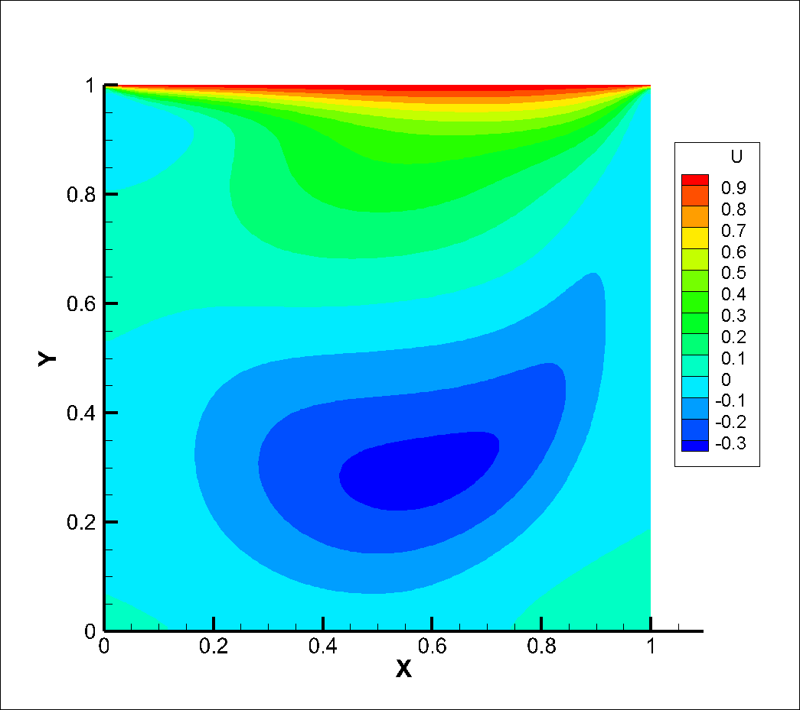
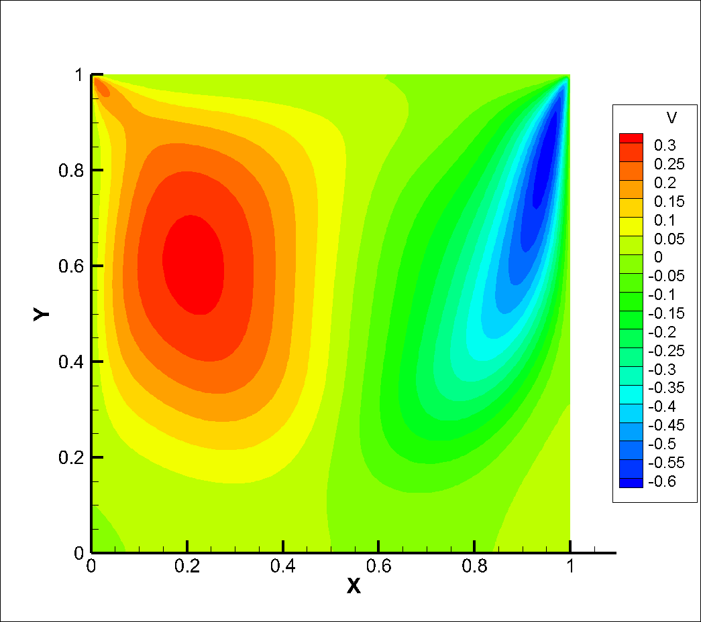
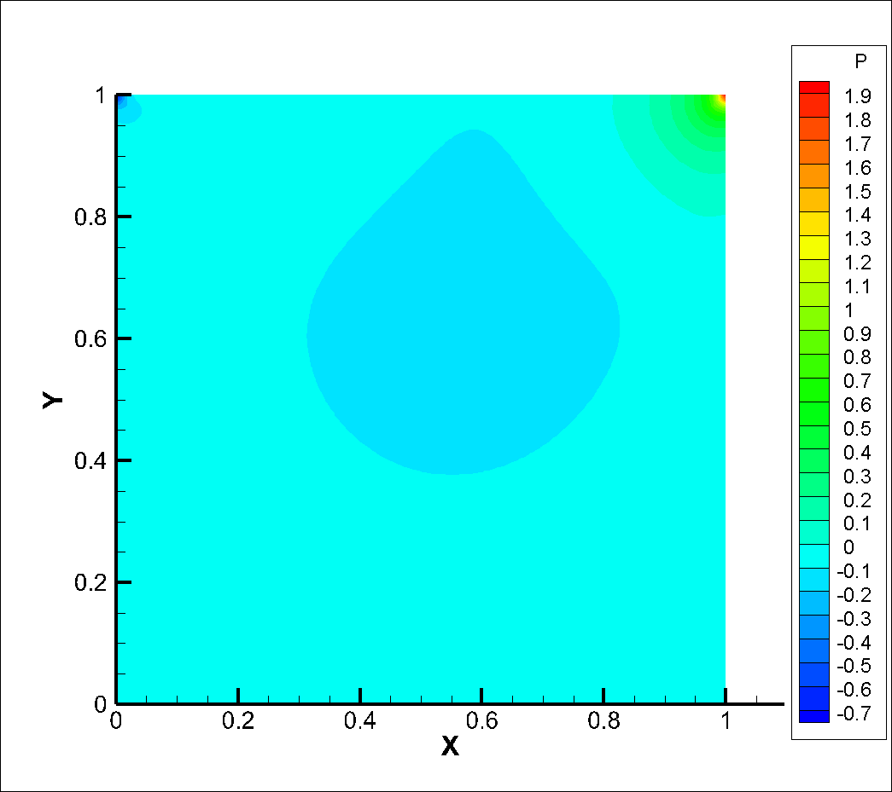

# Cavity
Coding practice of imcompressible flow.  
Mainly follow from Chapter10 of `Oleg Zikanov`'s book: __Essential Computational Fluid Dynamics__

## 2D Simulation
The classical projection method is used, where the contribution of velocity change is separeted into 2 parts: prediction without pressure term at first, then add correction from the contribution of pressure.  
Continuity is embodied in the pressure poisson equation.  
Central scheme is used for spatial discretization, and temporal discretization is simply 1st-order.  
Structured grid is used, and the code can be extended to unstructured easily. Variables are placed in ___staggered___ format as below:

Results(`Re=400`):

|

|

|

|
|:-:|:-:|:-:|
|Steady __u__ | Steady __v__ | Steady __p__ |

Usage:
> * Compile: `g++ src/main.cc -std=c++17 -I /usr/include/eigen3 -O3 -o build/Cavity`
> * Execute: `./Cavity`, may stop it manually when the divergence does not change.
> * View full flowfield: `Tecplot` or `ParaView` or `EnSight`
> * Animate convergency history: `python3 animate.py`
> * Path of `Eigen3` may vary in different systems or platforms, adjust it accordingly.

## 3D Simulation

