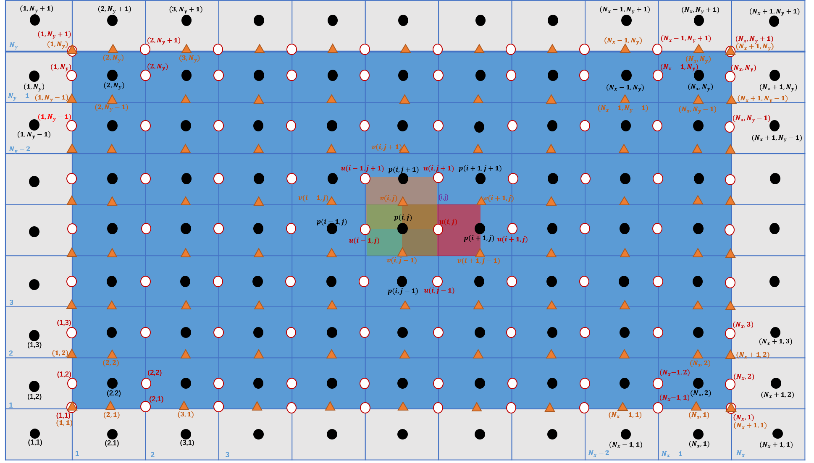
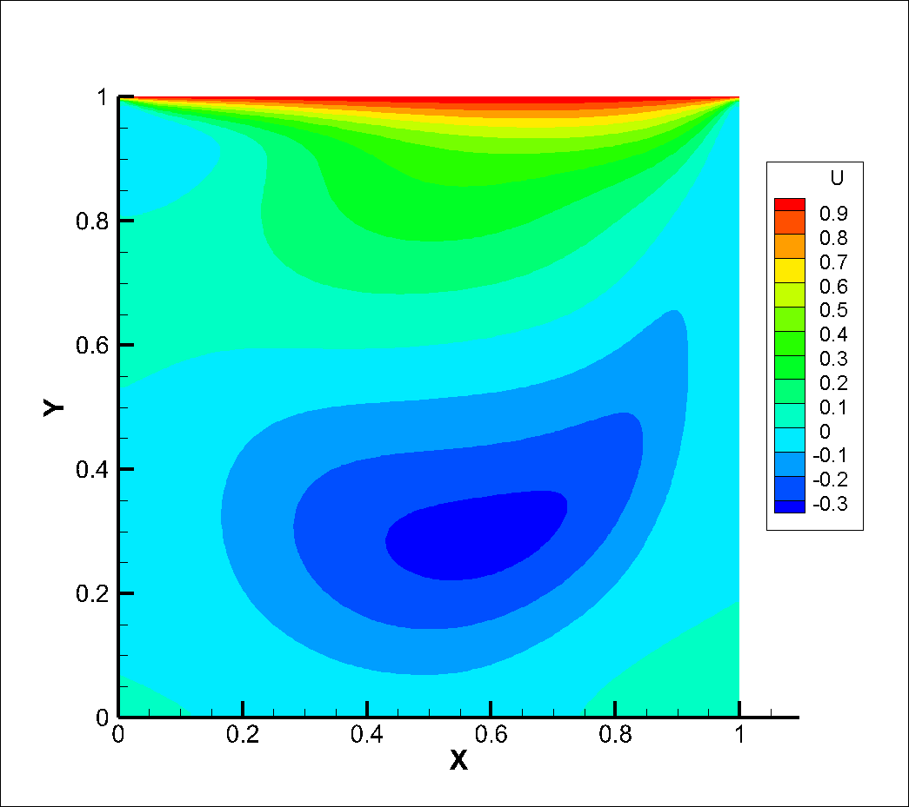

# Cavity
Coding practice of imcompressible flow.  
Follow from `Oleg Zikanov`'s book: __Essential Computational Fluid Dynamics__

## 2D Simulation(Chapter10)
Both structured and unstructured grid are tested.

### Structured grid
The classical projection method is used, where the contribution of velocity change is separeted into 2 parts: prediction without pressure term at first, then add correction from pressure contribution. 
Continuity is embodied in the pressure poisson equation.  
Central scheme is used for spatial discretization, and temporal discretization is simply 1st-order.  
Grid is uniform, the code can be extended to unstructured easily. Variables are placed in staggered format as below:

Usage:
> * Compile: `g++ main.cc -std=c++14 -I /usr/include/eigen3 -o Cavity`
> * Execute: `./Cavity`, may stop it manually when the divergence does not change.
> * View full flowfield: `Tecplot` or `ParaView` or `EnSight`
> * Animate convergency history: `python3 animate.py`
> * Path of `Eigen3` may vary in different systems or platforms, adjust it accordingly.

Results:

|

|

|

|
|:-:|:-:|:-:|
|Steady __u__ | Steady __v__ | Steady __p__ |

### Unstructured grid

## 3D Simulation

